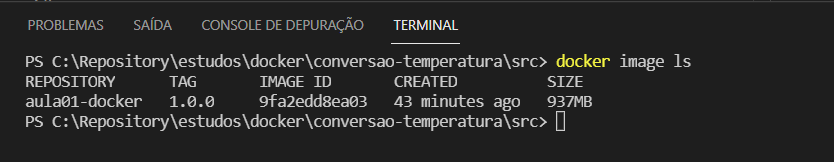
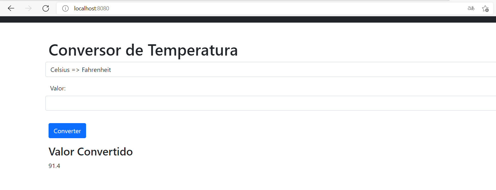

# PROCEDIMENTOS DOCKER

1. ### Criação da imagem

```
docker build -t aula01-docker:1.0.0 .
```


2. ### Execução do container

```
docker run -d -p 8080:8080 aula01-docker:1.0.0
```


### REFERENCES
- [Node - Official Image | Docker Hub](https://hub.docker.com/_/node?tab=description&page=1&ordering=last_updated)